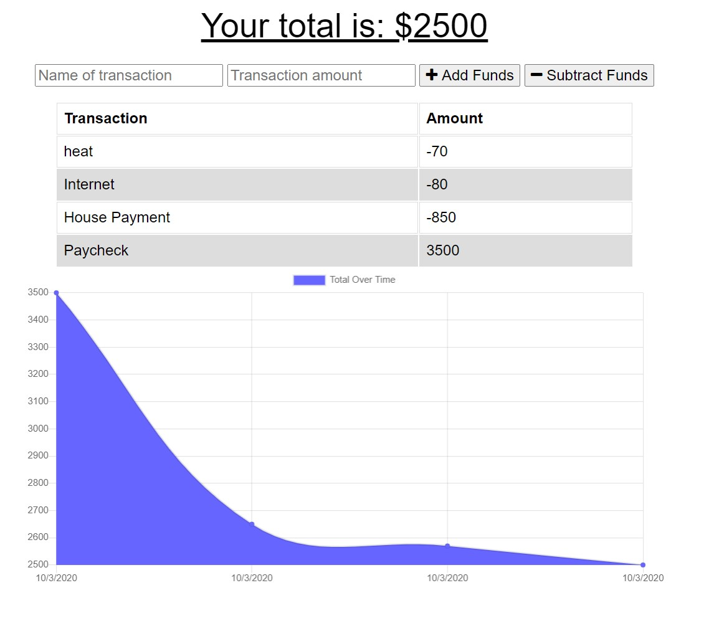

# Budget Tracker PWA

## Description

A simple budget tracking web application that allows the user to download it as a PWA to their device for offline use. Once they've reconnected to the internet, the app will automatically push the offline data to the server. It will notify the user when the upload happens. You can view the deployed application [here](https://protected-bastion-93932.herokuapp.com/) and the github [here](https://github.com/kwedwick/pwa-budget-tracker). 

    

## Table of Contents 
* [Installation](#Installation) 
* [Usage](#Usage) 
* [License](#License) 
* [Questions](#Questions) 

## Installation

You'll be using mongoDB, node.js, mongoose, and morgan packages to modify and deploy this web application. 
    

## Usage

This is for anyone looking to track their income and expendatures over time. At the moment this does not support deletion of any items. You'd need to add/subtract an ammount to balance it back out. This would be a future feature. 
    

## License
    
This project falls under the isc license. Please visit [isc](https://choosealicense.com/licenses/isc) to learn more.

## Questions
The author of this project is Keegan. You can reach them via [email](mailto:kwedwick@gmail.com).
To see more projects from this author, visit their [GitHub](https://github.com/kwedwick).